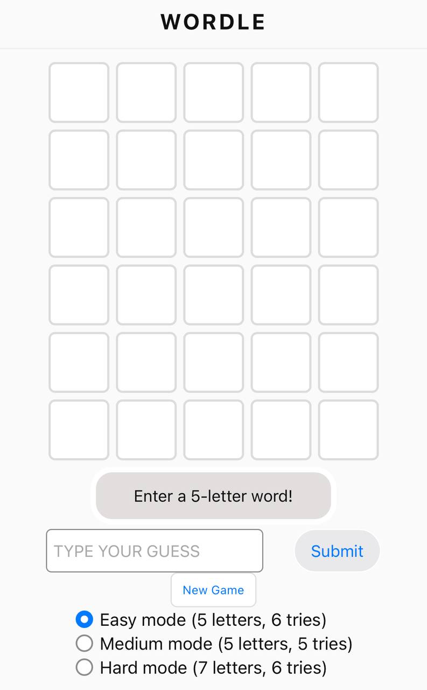

## Wordle

Creating a browser word guessing game. Players have a fixed number of tries to guess a secret word. In this version, there are three difficulties for the user.

## Screenshot/Logo

## 5.2 Game Name and Description

Name: Wordle

Description: This game challenges the player to guess a hidden word. Players type a guess and receive feedback:

- Green (exact): letter is in the correct position.
- Yellow (present): letter exists in the word but in the wrong position.
- Grey (absent): letter is not in the word.

Game modes:

- Easy: 5 letters, 6 tries
- Medium: 5 letters, 5 tries
- Hard: 7 letters, 6 tries

Why this game?
I chose this game as it allows me to practice JavaScript fundamentals such as arrays, objects, DOM manipulation and event listeners. Started off by hard coding the number of tries, but realised it's probably better to create variables for different mode difficulties, so that the game can be scaled to a more complex version of wordle.

---

## 5.3 Getting Started

Run Locally:

1. Clone or download this repository using `git clone https://github.com/junesutan/wordle.git`
2. Open `index.html` in browser
   Then visit `http://localhost:3000`.

How to Play (default mode is easy):

1. Choose a difficulty mode (Easy/Medium/Hard).
2. Type a guess word of the required length.
3. Submit your guess via `Submit` button or `Enter` key
4. Tiles update with feedback:
   - Green = correct letter, correct position
   - Yellow = correct letter, wrong position
   - Grey = incorrect letter
5. Win if you guess the secret word before running out of tries.

## 5.4 Attributions

- No external libraries are used.
- Word lists are hardcoded directly in `app.js`.
- Tutorials/help used:
  - GA notes
  - https://developer.mozilla.org/en-US/docs/Web/JavaScript/Reference
  - https://www.w3schools.com/js/

## 5.5 Technologies Used

- JavaScript: game logic, word checking, event handling
- HTML: structure
- CSS: tile styling, layout, game modes

## 5.6 Next Steps (Planned Future Enhancements)

- More animation for tile transitions
- Use a dictionary API to ensure users' guesses are real english words
- Stats tracking (streaks, win percentage)
- Shareable results (like the original Wordle)
- Daily puzzle mode
